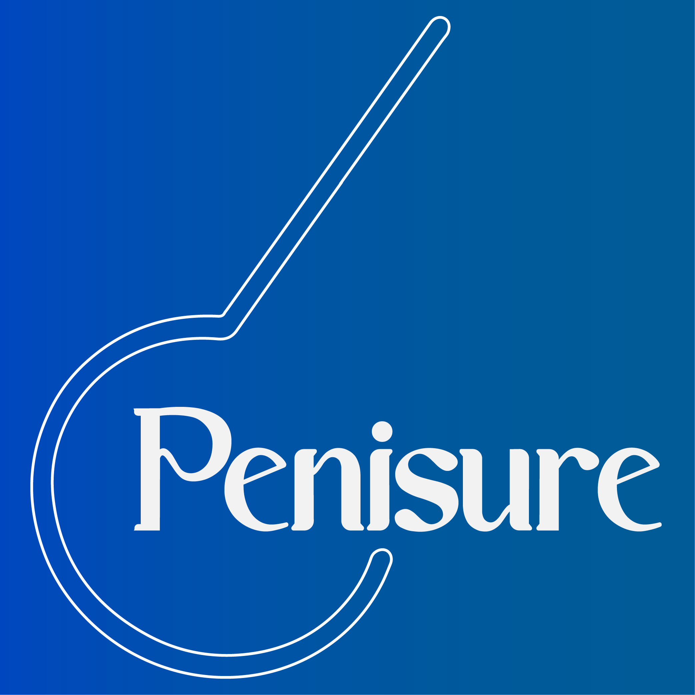

# Penisure: Your Comprehensive Erectile Dysfunction Screening and Penis Information App

Welcome to Penisure, your all-in-one solution for understanding and screening for erectile dysfunction (ED) while also providing you with essential facts about the penis. We are committed to your sexual health and well-being.

## Table of Contents

- [Introduction](#introduction)
- [Features](#features)
- [Getting Started](#getting-started)
- [FAQ](#faq)
- [Upcoming Features](#upcoming-features)
- [Contributing](#contributing)
- [Warranty](#warranty-disclaimer-limitation-of-liability)

## Introduction

Penisure is an educational and screening app designed to help individuals better understand erectile dysfunction and access relevant information about the male reproductive system. With an easy-to-use interface and valuable features, Penisure is here to empower you with knowledge and potentially identify potential issues related to ED.

## Features

### 1. **Screening**

Are you concerned about your erectile function? Penisure offers a quick and discreet screening tool to assess the likelihood of erectile dysfunction. This self-assessment helps you understand your risk factors and provides recommendations for further action.

### 2. **FAQ**

Get answers to common questions about the penis and erectile dysfunction. Our FAQ section is a valuable resource that provides accurate and informative responses to a wide range of inquiries related to male sexual health.

### 3. **Location (Coming Soon)**

Stay tuned for our upcoming "Location" feature, which will help you find nearby medical professionals, clinics, and specialists who can provide you with expert guidance and treatment options for erectile dysfunction.

## Getting Started

1. **Download and Install Penisure**
    - Download the latest release from GitHub.
    - Install the app on your device.

2. **Start Screening**
    - Take the ED screening test and receive your personalized results and recommendations.

3. **Explore the FAQ**
    - Dive into the FAQ section to learn more about the penis and erectile dysfunction.

## FAQ

Have questions about Penisure? Check out our frequently asked questions to find answers.

**Q: Is Penisure a medical diagnosis tool?**
A: No, Penisure is an informational and screening app. It can help identify potential risk factors for ED, but you should consult a healthcare professional for a formal diagnosis.

**Q: Is my data safe with Penisure?**
A: Yes, we take your privacy seriously. You don't even have to make an account to use our app. Your data NEVER leave your device!

**Q: When will the "Location" feature be available?**
A: We are actively working on it and plan to release the feature in the near future. Stay tuned for updates!

## Upcoming Features

We are continually working on improving Penisure to provide you with the best possible experience. Here are some features we are working on:

- **Expert Consultation**: Connect with medical professionals for private consultations and advice on ED.

- **Educational Resources**: Access in-depth articles, videos, and infographics related to sexual health.

- **In-depth screening**: We are working to integrate IIEF-15 into our app!

## Contributing

Penisure is an open-source project, and we welcome contributions from developers, designers, and writers. If you're interested in improving Penisure, please visit our [GitHub repository](https://github.com/Justforvan/penisure) to get involved.

We are dedicated to helping you take control of your sexual health and well-being. Download Penisure today and start your journey to a healthier, more informed you.

## WARRANTY DISCLAIMER. LIMITATION OF LIABILITY
Penisure is designed to provide information and offer a preliminary screening for erectile dysfunction (ED) based on user-provided data. While we work diligently to maintain the accuracy of our information and screening tool, it is crucial to understand that Penisure should not be used as a substitute for professional medical advice, diagnosis, or treatment.

Erectile dysfunction can be caused by a variety of factors, including underlying health conditions, medications, and psychological factors. The results obtained from the screening tool are intended to provide general guidance and raise awareness but should not be considered a definitive diagnosis.

If you have concerns about your sexual health or receive a high-risk result from the screening tool, we strongly recommend consulting a healthcare professional for a thorough evaluation and personalized advice. Please note that, despite our efforts, there may be bugs or inaccuracies in the app, and nothing can replace the expertise of a qualified medical practitioner when it comes to diagnosing and treating medical conditions.